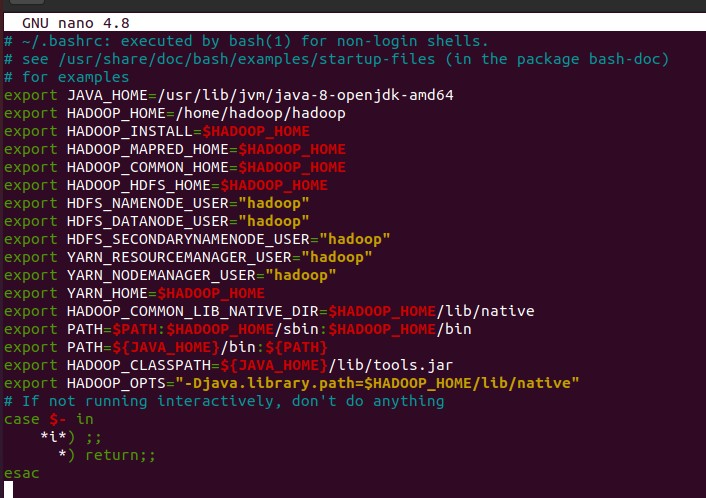

# Hadoop_SBD-K1-Group10

---
## Anggota Kelompok
```
1. Muhammad Najih Aflah - 2106653880
2. Mochammad Dyenta D - 2106731245
3. Rayhan Akbar Arrizky - 2106632655
4. Muhammad Fajri Alqomaril - 2106651635
5. Agung Firmansyah - 2006577454
```
---
---
## Table of Contents
```
1. Apa itu Hadoop?
2. Tata cara instalasi Hadoop
3. Konfigurasi Hadoop
4. Menjalankan Word Count dengan Hadoop
5. Perbandingan Word Count dengan dan tanpa Hadoop
```
---

## Apa itu Hadoop?

Hadoop adalah kerangka kerja (framework) open-source yang dirancang untuk memproses, menyimpan, dan menganalisis jumlah data besar (big data) secara terdistribusi. Dikembangkan oleh Apache Software Foundation, Hadoop menyediakan solusi untuk mengatasi tantangan dalam pengelolaan dan analisis data yang sangat besar yang tidak dapat ditangani oleh sistem tradisional.

---

## Tata cara instalasi Hadoop.

Hal-hal yang perlu diperhatikan ketika instalasi Hadoop adalah:
```
1. Sudah meng-install Java 8
2. Setup Java environment path
3. Install hadoop melalui link: https://hadoop.apache.org/releases.html
4. Setup Hadoop environment path
```
### Cek versi Java


### Setup environment path untuk Java


### Setup environment path untuk Hadoop


---

## Konfigurasi Hadoop

Hadoop environment dikonfigurasi dengan mengedit sekumpulan file konfigurasi yaitu :
```
1. bashrc, 
2. hadoop-env.sh 
3. core-site.xml
4. hdfs-site.xml 
5. mapred-site-xml 
6. yarn-site.xml
```
### 1. bashrc



### 2. hadoop-env.sh


### 3. core-site.xml


### 4. hdfs-site.xml


### 5. mapred-site.xml


### 6. yarn-site.xml


---

## Menjalankan Word Count dengan Hadoop

Langkah-langkah yang perlu dilakukan untuk menjalankan program Word Count dengan Hadoop adalah:
```
1. Memformat NameNode sebelum memulai Hadoop
2. Memulai Hadoop cluster
3. Menempatkan file ujicoba di hadoop
4. Menjalankan program Word Count
5. Mendapatkan hasil Word Count
```

### 1. Memformat NameNode sebelum memulai Hadoop


### 2. Memulai Hadoop cluster


### 3. Menempatkan file ujicoba di hadoop


### 4. Menjalankan program Word Count


### 5. Mendapatkan hasil Word Count


---

## Perbandingan Word Count dengan dan tanpa Hadoop

Spesifikasi sistem untuk eksperimen
```
OS: Ubuntu 20.04 (Virtual Machine)
CPU allocated: 6 CPUs
Base Memory allocated: 8192 GB RAM
```
Langkah-langkah yang perlu dilakukan adalah:
```
1. Menyiapkan program word count dengan Hadoop
2. Menyiapkan program word count tanpa Hadoop
3. Menyiapkan dataset untuk eksperimen
4. Setup Hadoop untuk perbandingan
5. Menjalankan Word Count dengan dan tanpa hadoop untuk masing-masing dataset
6. Melihat grafik perbandingan
```

### Program Word Count dengan Hadoop


### Program Word Count tanpa Hadoop


### Datasets

link dataset: https://drive.google.com/file/d/14Wgtvllbu1mpDyjF9SmQ9i410lNUkqYK/view?usp=sharing 


### Setup Hadoop untuk perbandingan


### Grafik perbandingan


---
## Analisis hasil perbandingan dan kesimpulan

Pada ukuran file yang masih kecil mulai dari 1-500MB, Word Count tanpa hadoop terlihat lebih cepat dibanding word count dengan hadoop.
Namun berdasarkan grafik yang dihasilkan, dapat dilihat bahwa Word Count tanpa hadoop memiliki peningkatan waktu yang lebih signifikan dibandingkan Word Count dengan hadoop.

### Kesimpulan:

Pada ukuran file yang besar, word count dengan hadoop lebih unggul dibandingkan word count tanpa hadoop

---


